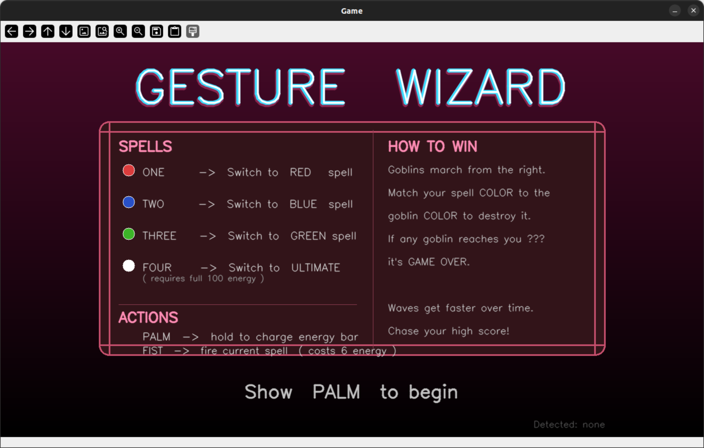
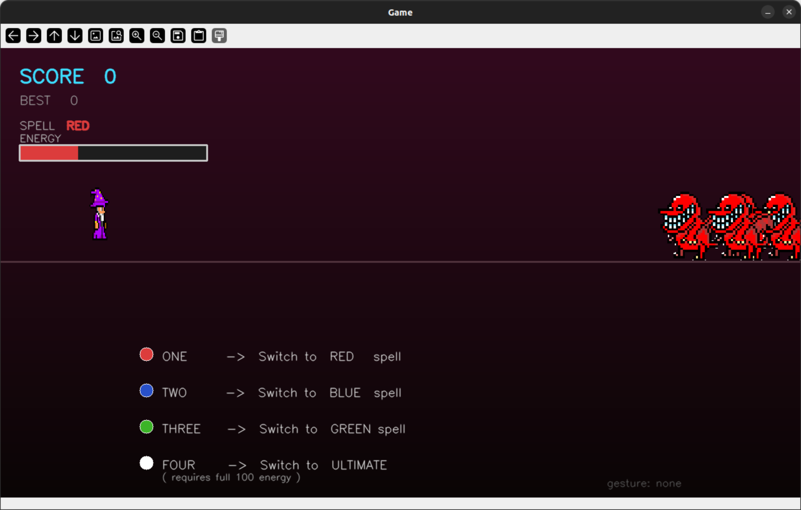
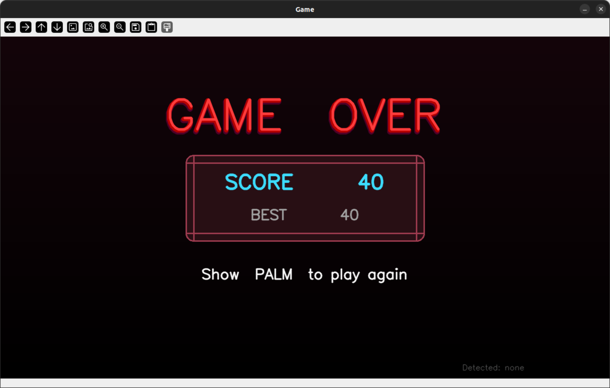
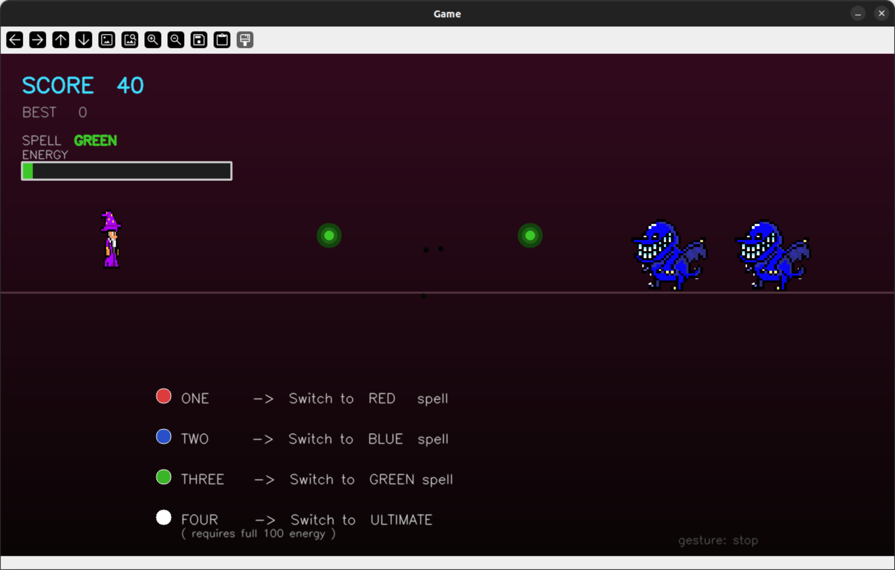

# 🧙 Gesture Wizard

> A real-time gesture-controlled arcade game where you cast spells with your bare hands to destroy waves of marching goblins — powered by computer vision and a custom-trained YOLO model.

---

## 📸 Screenshots

| Start Screen | Gameplay |
|---|---|
|  |  |

| Game Over | Spell Casting |
|---|---|
|  |  |

---

## ✨ Features

- 🖐️ **Hands-free controls** — no keyboard or mouse needed during gameplay
- 🎯 **Real-time gesture detection** via a custom YOLOv8 model running on a background thread
- 🌈 **Four spell types** — Red, Blue, Green, and a screen-clearing Ultimate
- 👾 **Animated goblin enemies** with a 4-frame walk cycle and alpha-blended sprites
- ⚡ **Energy system** — charge up with your palm, spend energy to fire spells
- 📈 **Escalating difficulty** — enemy speed and spawn rate increase with your score
- 💥 **Particle death effects** — color-matched burst particles on every kill
- 🏆 **High score tracking** across rounds within a session

---

## 🎮 How to Play

### Objective
Goblins march from the right side of the screen. You must fire spells that **match the color of each goblin** to destroy it. If any goblin reaches you, it's **Game Over**.

### Gestures

| Gesture | Action |
|---|---|
| ✋ **Palm** | Hold to charge your energy bar / Start or restart the game |
| ✊ **Fist** | Fire your currently selected spell (costs 6 energy) |
| ☝️ **One** | Switch to **Red** spell |
| ✌️ **Peace** | Switch to **Blue** spell |
| 🤟 **Three** | Switch to **Green** spell |
| 🖐️ **Four** | Switch to **Ultimate** spell (requires 100 energy) |

### Spells

| Spell | Color | Effect |
|---|---|---|
| Red | 🔴 | Destroys red goblins |
| Blue | 🔵 | Destroys blue goblins |
| Green | 🟢 | Destroys green goblins |
| Ultimate | ⚪ | Fires a 5-ball spread that destroys **all** goblin colors |

---

## 🗂️ Project Structure

```
gesture-wizard/
│
├── main.py               # Main game script
├── best.pt               # Trained YOLO gesture detection model
├── requirements.txt      # Python dependencies
│
├── wizard.png            # Idle wizard sprite
├── charge.png            # Charging wizard sprite
├── redgoblin.png         # Red goblin sprite
├── bluegoblin.png        # Blue goblin sprite
├── greengoblin.png       # Green goblin sprite
│
└── screenshots/          # (optional) Add your own screenshots here
```

---

## ⚙️ Setup & Installation

> ⚠️ **It is strongly recommended to use a separate virtual environment** for this project to avoid dependency conflicts with other Python projects on your system.

### 1. Clone the Repository

```bash
git clone https://github.com/your-username/gesture-wizard.git
cd gesture-wizard
```

### 2. Create a Virtual Environment

**macOS / Linux:**
```bash
python3 -m venv venv
source venv/bin/activate
```

**Windows:**
```bash
python -m venv venv
venv\Scripts\activate
```

You should see `(venv)` at the start of your terminal prompt once it's active.

### 3. Install Dependencies

With the virtual environment active, install all required packages from the root-level `requirements.txt`:

```bash
pip install -r requirements.txt
```

### 4. Add Required Files

Make sure the following files are present in the project root before running:

- `best.pt` — the trained YOLO model for gesture detection
- `wizard.png`, `charge.png` — wizard sprites
- `redgoblin.png`, `bluegoblin.png`, `greengoblin.png` — goblin sprites

### 5. Run the Game

```bash
python main.py
```

A window titled **"Game"** will open. Hold up your **palm** to the camera to begin.

Press **`Q`** at any time to quit.

---

## 📦 Requirements

All dependencies are listed in `requirements.txt` at the root of the project. Key packages include:

| Package | Purpose |
|---|---|
| `opencv-python` | Rendering, image processing, window display |
| `numpy` | Array math and image manipulation |
| `ultralytics` | YOLOv8 model inference for gesture detection |

---

## 🧠 How It Works

The game runs two concurrent threads:

1. **YOLO Thread** — Continuously reads frames from your webcam and runs inference using `best.pt`. A 5-frame rolling history is used to stabilize gesture predictions before they affect the game.

2. **Game Loop** — Renders the game at the highest possible frame rate using OpenCV. It reads the latest stable gesture from shared memory (protected by a thread lock) and updates game state accordingly.

This separation ensures that the relatively expensive model inference never blocks the rendering pipeline.

---

## 💡 Tips

- Make sure your hand is **clearly visible** and well-lit for the best gesture detection accuracy.
- Hold gestures **steady** for a moment — the detector uses a 5-frame history to avoid jitter.
- Keep an eye on your **energy bar** — you can't fire without energy, and the Ultimate costs a full bar.
- Enemies get **faster and spawn more frequently** as your score climbs — prioritize by color!

---

<p align="center">Made with 🔮 and OpenCV</p>
